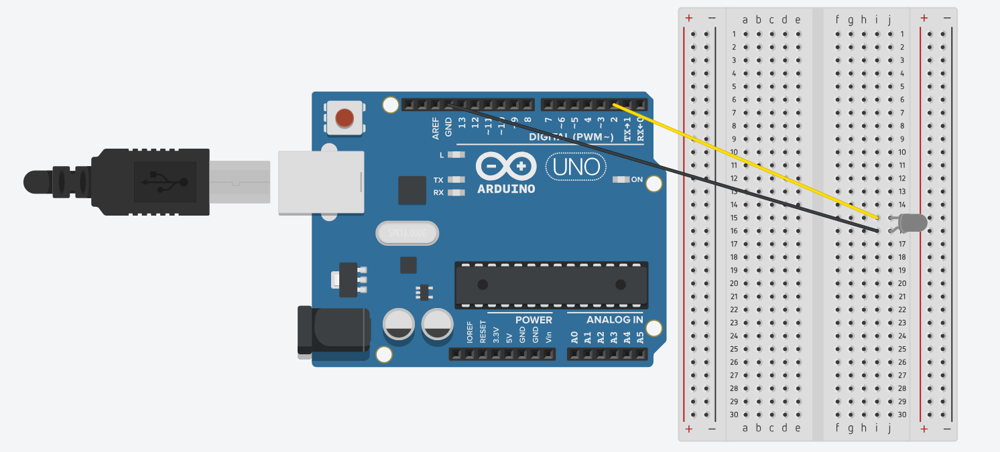

# Working with LEDs

## Making LEDs Blink

Now that we have the Arduino IDE, let's actually code something. First connect an LED to the arduino as follows. An LED has two sides, a positive and negative. The longer end of the LED must be connected to the positive voltage (in this case pin 2 of the Arduino). Let's make the circuit shown below.



[The longer end of the LED is connected to **Pin 2** of the Arduino and the shorter end is connected to **GND**].

To check that everything is working, let's first write a simple program that turns the LED on and off. Use the code given below. (Note that anything that comes after a "//" is a comment and is left in the code to make it more understandable).

```c
void setup() {
    // Setup pin 2 as an output pin.
    // We can choose whether to send electricity through this pin or not
    pinMode(2, OUTPUT);
}

void loop() {
    digitalWrite(2, HIGH); // Turns on the LED
    delay(500); // Wait for 500 ms
    digitalWrite(2, LOW); // Turn off the LED
    delay(500); // Wait for another 500 ms
}
```

We write code for the Arduino in C, but it's a special kind of C for arduino. Every program as a **setup function** and a **loop function**. The `setup` function runs once when the program starts running and the `loop` function keeps repeating forever. In the example above, the setup function tells the Arduino to treat **Pin 2** as an output pin and the loop function toggles **Pin 2** on and off forever. 

## Making the LEDs do More than just Blink

What if we want to dim the LED? Unfortunately, all we know how to do is turn the LED on and off. It turns out, that's all we need to know!

The human eye cannot distinguish between a rapidly blinking LED and a dim LED. So, what we can do is turn on the LED for 1 millisecond and keep it off for 19 milliseconds. This will only allow it to be on 5% of the time and therefore make the LED run at 5% brightness. So, we can use the same circuit as before and modify the code ever so slightly.

```c
void setup() {
    // Setup pin 2 as an output pin.
    // We can choose whether to send electricity through this pin or not
    pinMode(2, OUTPUT);
}

void loop() {
    // Only keep the LED on for 5% of the time
    digitalWrite(2, HIGH);
    delay(1);
    digitalWrite(2, LOW);
    delay(19);
}
```

You might notice the LED flicker a bit. To fix this, replace the `delay` function with the `delayMicroseconds` function. It does exactly what you think it does!
