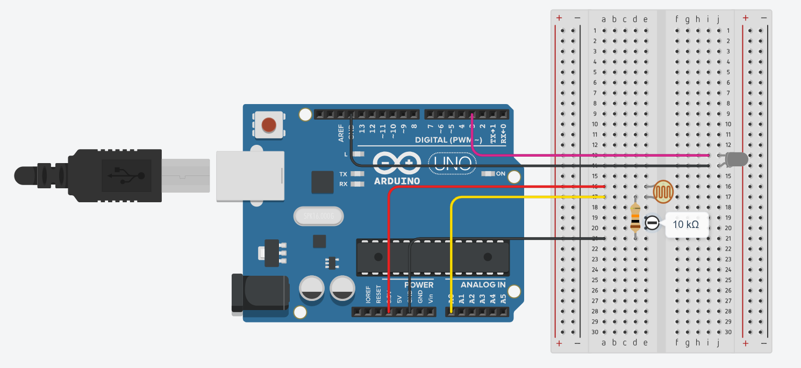
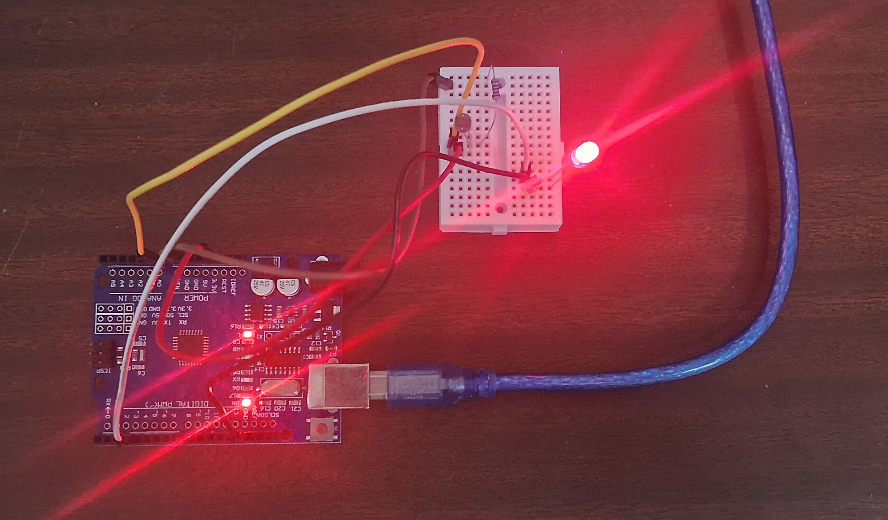

# Project: Night Light


To make a nightlight, we will use an LDR to detect how bright the environment is. The Arduino has **analog** pins. Unlike the digital pins, that we just used, this let's us read/write numbers between 0 to 1023 instead of just the binary 0 (off) and 1 (on) that we used. We will use this to detect how much light there is.

## Circuit Setup

First make the circuit shown below.


We are connecting **Pin 3** to the positive (longer side) of the LED and **GND** to the shorter side of the LED. This let's us control the LED. Next we connect the **3.3 V** power source of the arduino to one side of the light detector. We connect one side of a resistor to the other side of the light detector. To the other side of the resistor we connect the **GND** of the arduino. 

If you look at the Arduino you will notice that certain pins have squiggly lines next to them. These are special because we can write analog values (between 0 and 1023) to these pins.

> Pins with squiggly lines also use the same technique we used in our [previous article](controlling-leds.md) of quickly switching on and off the pin. However, this is done using a built-in hardware timer, and is much more reliable (and easy to use).

## Code

Now that we have our circuit, let's write the code for it. We use the `analogRead` function to get a number from 0 - 1023 from **Pin A0**. We will use the `analogWrite` function to set the brightness of the LED on **Pin 3**. Based on my testing, when completely dark, we can expect a number of ~30. When very bright, we can expect a number of ~620.

Our code will dim the LED if the value we get from the sensor is high and brighten the LED if the sensor value is low.

```c
void setup() {
    pinMode(3, OUTPUT); // Set Pin 3 to output mode
}

void loop() {
    int sensorValue = analogRead(A0); // Read the sensor value

    // Make high values low and low values high.
    // The variable 'inverted' is a number between 0 and 630. 
    int inverted = (630 - min(sensorValue, 630));

    // Take our inverted number (from 0 to 630)
    // convert it to a number from 0 - 1023
    int brightness = inverted*1.62;

    analogWrite(3, brightness); // Sets the brightness of pin 3 to that numeber
}
```

## Final Product

